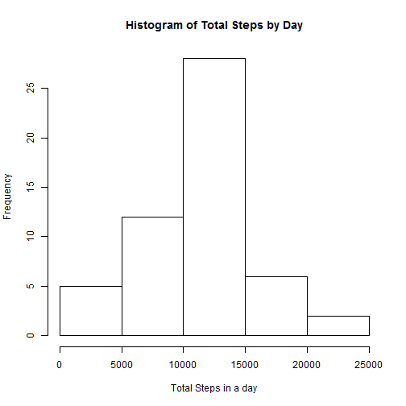
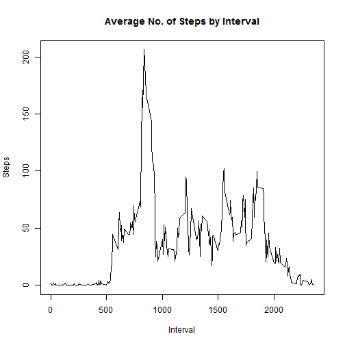
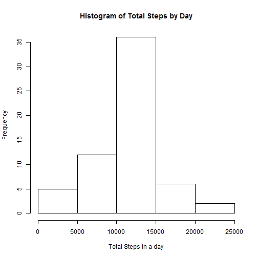
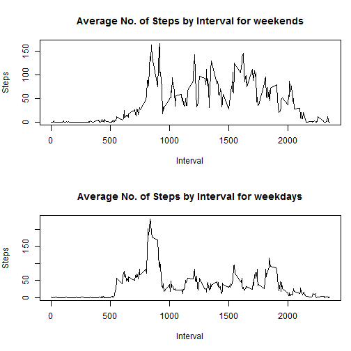

##Overview
In this report, an analysis of the number of steps taken per day is carried out on data collected from personal activity monitoring devices from anonymous individuals collected over a period of 2 months. 

##Getting and Cleaning Data
First, the file is read into a dataframe using the read.csv function from a csv file. Since it's specified in the instructions, it's safe to remove the NA using the complete.cases function for this section.

```r
library(knitr)
file <- "C:/Users/John Goh/Documents/Professional Studies/Coursera/Data Science (John Hopkins)/05 Reproducible Research/Assignment/data/activity.csv"
activity <- read.csv(file, header=TRUE,sep=",")
activity_xna <- activity[complete.cases(activity),]
```
##Section 1: Total Number of Steps Taken per Day
The next step is to sum the data by Date into a column named "total_steps".

```r
total_steps_byday <- aggregate(activity_xna$steps,list(date=activity_xna$date),sum)
colnames(total_steps_byday)[2] <- "total_steps"
```

We then plot the histogram of total number of steps taken each day as below:

```r
hist(total_steps_byday$total_steps, xlab="Total Steps in a day", main="Histogram of Total Steps by Day")
```

 

Next the mean and median of steps by day are calculated. 

```r
mean(total_steps_byday$total_steps)
```

```
## [1] 10766.19
```

```r
median(total_steps_byday$total_steps)
```

```
## [1] 10765
```

##Section 2: Average Daily Activity Pattern
First we aggregate the steps by similar interval over the period

```r
five_min_interval_avg <- aggregate(steps ~ interval, activity_xna, mean)
```

We then plot the results in a time series line graph:

```r
plot(five_min_interval_avg$interval,five_min_interval_avg$steps,type="l",ylab="Steps",xlab="Interval",main="Average No. of Steps by Interval")
```

 

The time interval with the maximum number of steps is 835. 

```r
as.integer(five_min_interval_avg[which.max(five_min_interval_avg$steps),]["interval"])
```

```
## [1] 835
```

##Section 3: Imputing missing values
In this section, we start by calculating and reporting the total number of missing values in the dataset:

```r
sum(is.na(activity))
```

```
## [1] 2304
```

We then impute the NA with the earlier calculated mean by similar interval. The new dataset created is called new_merged.

```r
colnames(five_min_interval_avg)[2] <- "no_steps"
activity_imputed <- activity
index <- is.na(activity_imputed$steps)
merged = merge(activity_imputed, five_min_interval_avg, by.x="interval", by.y="interval")
new_merged <- merged[with(merged, order(merged$date)),]
new_merged$steps[index] <- new_merged$no_steps[index]
new_merged <- new_merged[, -which(names(new_merged) %in% c("no_steps"))]
```
We then reaggregate the data by date and a new histogram is plotted. 

```r
new_total_steps_byday <- aggregate(new_merged$steps,list(date=new_merged$date),sum)
colnames(new_total_steps_byday)[2] <- "total_steps"
hist(new_total_steps_byday$total_steps, xlab="Total Steps in a day", main="Histogram of Total Steps by Day")
```

 

The shape of the histogram is similar as before, generally indicating similarities between the distributions of total steps in a day. This is followed by calculations of the mean and median of steps by day.

```r
mean(new_total_steps_byday$total_steps)
```

```
## [1] 10766.19
```

```r
median(new_total_steps_byday$total_steps)
```

```
## [1] 10766.19
```

##Section 4: Difference in activity patterns between weekdays and weekends
In this section, we first convert the dates into days using the weekday() function. The days are then factorized into weekday and weekend categories. 

```r
date_list <- as.Date(new_merged$date)
day_of_week <- weekdays(date_list)
day_of_week <- factor(day_of_week)
levels(day_of_week) <- list(weekday=c("Monday","Tuesday","Wednesday","Thursday","Friday"),weekend=c("Saturday","Sunday"))
day_of_week_df <- data.frame(day_of_week)
colnames(day_of_week_df)[1] <- "category"
new_merged <- cbind(new_merged,day_of_week_df)
```

We then split the dataframes and aggregate them separately.

```r
weekend_df <- new_merged[new_merged$category=="weekend",]
weekday_df <- new_merged[new_merged$category=="weekday",]
weekend_five_min_interval_avg <- aggregate(steps ~ interval, weekend_df, mean)
weekday_five_min_interval_avg <- aggregate(steps ~ interval, weekday_df, mean)
```
This is followed by plotting the respective line graphs of intervals vs step.

```r
par(mfrow=c(2,1),pin = c(5, 1.8),mai=c(0.5,0.5,0.5,0.5),mar=c(5,4,4,1))
plot(weekend_five_min_interval_avg$interval,weekend_five_min_interval_avg$steps,type="l",ylab="Steps",xlab="Interval",main="Average No. of Steps by Interval for weekends")
plot(weekday_five_min_interval_avg$interval,weekday_five_min_interval_avg$steps,type="l",ylab="Steps",xlab="Interval",main="Average No. of Steps by Interval for weekdays")
```

 
